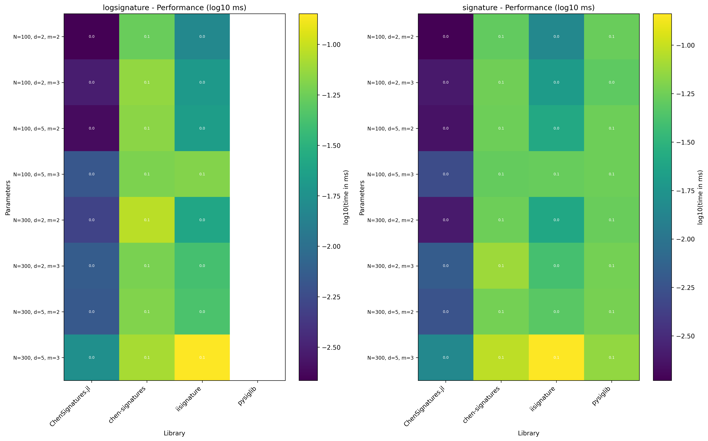

# Signature Method Benchmark Suite

Performance benchmarking suite for signature computation libraries with **strict isolation** and **methodological fairness**.

## Architecture

This benchmark suite uses an **Orchestrator-Adapter** architecture to ensure fair comparisons:

- **Orchestrator** ([src/orchestrator.py](src/orchestrator.py)): Main driver that coordinates benchmark execution
- **Adapters**: Individual scripts for each library, running in isolated environments
  - Python adapters use `uv run` with ephemeral environments
  - Julia adapters use isolated `JULIA_PROJECT` environments
- **Manual Timing Loops**: Identical timing methodology across languages (no timeit, pyperf, or BenchmarkTools)

## Libraries Benchmarked

- **iisignature** (Python, industry standard)
- **pysiglib** (Python, PyTorch-based)
- **chen-signatures** (Python, with autodiff support)
- **ChenSignatures.jl** (Julia)

## Features

- **Strict Isolation**: Each library runs in its own ephemeral environment
- **Methodological Fairness**: Identical manual timing loops across all languages
- **Setup/Kernel Separation**: Only the computation is timed, not data preparation
- **Multiple Operations**: signature, logsignature, sigdiff (autodiff)
- **Scaling Analysis**: Varies N (path length), d (dimension), m (signature level)

## Latest Public Run (2025-12-02)

The newest full benchmark is checked into the repo at `runs/benchmark_20251202_223554/` so results are browseable without rerunning.

- Data: [`results.csv`](runs/benchmark_20251202_223554/results.csv)
- Plots: [`plot_heatmap.png`](runs/benchmark_20251202_223554/plot_heatmap.png), [`plot_speedup_slowest.png`](runs/benchmark_20251202_223554/plot_speedup_slowest.png), [`plot_profile.png`](runs/benchmark_20251202_223554/plot_profile.png), [`plot_box.png`](runs/benchmark_20251202_223554/plot_box.png), [`plot_line.png`](runs/benchmark_20251202_223554/plot_line.png)
- Config snapshots: [`benchmark_sweep.yaml`](runs/benchmark_20251202_223554/benchmark_sweep.yaml), [`libraries_registry.yaml`](runs/benchmark_20251202_223554/libraries_registry.yaml)



---

## 📋 Prerequisites

To run the benchmarks, you need:

1. **Julia** ≥ 1.10
2. **Python** ≥ 3.9
3. **[uv](https://github.com/astral-sh/uv)** – fast Python package manager

Install `uv`:

```bash
# macOS / Linux
curl -LsSf https://astral.sh/uv/install.sh | sh

# Windows (PowerShell)
irm https://astral.sh/uv/install.ps1 | iex
```

---

## 🚀 Quick Start

### Run Everything (Benchmarks + Plots)

```bash
uv run run_benchmarks.py
```

This single command will:
1. Run all benchmarks with configured libraries
2. Generate comparison plots automatically
3. Show you the output directory

### Run Individual Steps

If you want more control:

**Benchmarks only:**
```bash
uv run src/orchestrator.py
```

**Plots only:**
```bash
# Generate all plot types on latest run
uv run src/plotting.py --plot-type all

# Generate specific plot type
uv run src/plotting.py --plot-type heatmap

# Use specific run directory
uv run src/plotting.py runs/benchmark_TIMESTAMP --plot-type speedup

# List available plot types
uv run src/plotting.py --list-plots
```

### Plot Types Available

The plotting tool generates multiple visualization types:

- **`line`** - Original 3×3 grid of line plots showing absolute performance
- **`heatmap`** - Complete performance landscape across all parameter combinations (log scale)
- **`speedup`** - Relative performance showing speedup vs baseline (default: slowest library)
- **`profile`** - Performance profile showing how often each library is competitive
- **`box`** - Distribution of performance across all benchmarks with outliers
- **`all`** - Generate all plot types at once (default)

**Examples:**
```bash
# Generate all plots
uv run src/plotting.py

# Only heatmap
uv run src/plotting.py -t heatmap

# Speedup vs fastest library instead of slowest
uv run src/plotting.py -t speedup --baseline fastest

# Speedup vs specific library
uv run src/plotting.py -t speedup --baseline iisignature
```

### What Gets Created

Each run creates a timestamped folder in `runs/` containing:
- `results.csv` - All benchmark results
- `plot_line.png` - Line plot (original 3×3 grid)
- `plot_heatmap.png` - Heatmap of all benchmarks
- `plot_speedup_slowest.png` - Speedup plot vs slowest
- `plot_profile.png` - Performance profile
- `plot_box.png` - Box plot distribution
- `benchmark_sweep.yaml` - Config snapshot
- `libraries_registry.yaml` - Registry snapshot

---

## 📁 Repository Structure

```
.
├── config/
│   ├── benchmark_sweep.yaml       # Parameter sweep configuration
│   └── libraries_registry.yaml    # Library adapter registry
├── src/
│   ├── orchestrator.py            # Main benchmark driver
│   ├── plotting.py                # Plot generation
│   └── common/                    # Shared utilities (injectable)
│       ├── __init__.py
│       ├── adapter.py             # BenchmarkAdapter base class
│       └── paths.py               # Path generation utilities
├── adapters/
│   ├── python/                    # Python adapter scripts
│   │   ├── run_iisignature.py
│   │   ├── run_pysiglib.py
│   │   └── run_chen.py
│   └── julia/                     # Julia adapter project
│       ├── Project.toml
│       └── run_chen.jl
├── runs/                          # Benchmark output folders
└── pyproject.toml                 # Orchestrator dependencies
```

### Run Folder Contents

Each benchmark run creates a timestamped folder:

```
runs/benchmark_20251201_143022/
├── benchmark_sweep.yaml          # Config snapshot
├── libraries_registry.yaml       # Registry snapshot
├── results.csv                   # Aggregated benchmark results
├── plot_line.png                 # Line plot (3×3 grid)
├── plot_heatmap.png              # Heatmap visualization
├── plot_speedup_slowest.png      # Speedup plot
├── plot_profile.png              # Performance profile
└── plot_box.png                  # Box plot distribution
```

---

## ⚙️ Configuration

### Benchmark Sweep ([config/benchmark_sweep.yaml](config/benchmark_sweep.yaml))

Defines the parameter grid:

```yaml
path_kind: "sin"               # "linear" or "sin"

Ns: [200, 400, 800]            # Path lengths
Ds: [2, 5, 7]                  # Dimensions
Ms: [2, 3, 4]                  # Signature levels

operations:
  - signature
  - logsignature
  - sigdiff

repeats: 10                    # Timing loop iterations
runs_dir: "runs"
```

### Library Registry ([config/libraries_registry.yaml](config/libraries_registry.yaml))

Defines available adapters and their dependencies:

```yaml
libraries:
  iisignature:
    type: python
    script: "adapters/python/run_iisignature.py"
    deps: ["iisignature", "numpy"]
    operations: ["signature", "logsignature"]

  ChenSignatures.jl:
    type: julia
    dir: "adapters/julia"
    script: "run_chen.jl"
    operations: ["signature", "logsignature"]
```

**Note:** Large configurations (high N × d × m) can take significant time. Start small for testing.

---

## 📊 Output Format

### CSV Schema

All benchmarks output to a unified CSV format:

```csv
N,d,m,path_kind,operation,language,library,method,path_type,t_ms
200,2,2,sin,signature,python,iisignature,sig,ndarray,0.123
200,2,2,sin,signature,julia,ChenSignatures.jl,signature_path,Vector{SVector},0.089
```

**Columns:**
- `N`, `d`, `m`: Problem parameters (path length, dimension, signature level)
- `path_kind`: Path generator type (`linear` or `sin`)
- `operation`: Operation type (`signature`, `logsignature`, or `sigdiff`)
- `language`: `julia` or `python`
- `library`: Implementation name
- `method`: Specific method/function called
- `path_type`: Input data structure (`ndarray`, `Vector{SVector}`, `torch`, etc.)
- `t_ms`: Average time in milliseconds (averaged over `repeats` iterations)

---

## 🔧 How It Works

### Isolation Guarantees

Each library benchmark runs in complete isolation:

**Python adapters:**
```bash
uv run --with <dep1> --with <dep2> python <script> '<json_config>'
```

- `uv run` creates an ephemeral environment per invocation
- Dependencies are injected via `--with` flags
- Adapters add `src/` to `sys.path` to access common utilities
- No shared virtualenv or global state

**Julia adapters:**
```bash
JULIA_PROJECT=adapters/julia julia run_chen.jl '<json_config>'
```

- Each adapter has its own `Project.toml`
- No shared global Julia environment

### Manual Timing Loop

All adapters use the same timing methodology (no timeit/pyperf/BenchmarkTools):

**Python:**
```python
# Warmup (untimed)
for _ in range(3):
    func()

# Timed loop with GC disabled
gc.disable()
t0 = time.perf_counter()
for _ in range(repeats):
    func()
t1 = time.perf_counter()
gc.enable()

avg_time_ms = ((t1 - t0) / repeats) * 1000
```

**Julia:**
```julia
# Warmup (untimed)
for _ in 1:3
    func()
end

# Timed loop with GC disabled
GC.enable(false)
t0 = time_ns()
for _ in 1:repeats
    func()
end
t1 = time_ns()
GC.enable(true)

avg_time_ms = ((t1 - t0) / repeats) / 1e6
```

### Setup/Kernel Separation

Adapters separate "Setup" (untimed) from "Kernel" (timed):

```python
def run_signature(self, path, d, m):
    # Setup phase (untimed): data casting, basis preparation
    path = np.ascontiguousarray(path, dtype=np.float64)

    # Return kernel closure (only this is timed)
    return lambda: iisignature.sig(path, m)
```

---

## 📈 Interpreting Results

### Understanding the Plots

**Line Plot (`plot_line.png`):**
- 3×3 grid showing absolute timing (ms)
- Rows: vary N, d, or m
- Columns: different operations
- Lower lines = faster performance

**Heatmap (`plot_heatmap.png`):**
- Shows ALL parameter combinations at once
- Darker colors (blue/purple) = faster
- Lighter colors (yellow) = slower
- Numbers show actual milliseconds
- Best for seeing the complete performance landscape

**Speedup Plot (`plot_speedup_slowest.png`):**
- Same layout as line plot but shows relative performance
- Y-axis = speedup factor (higher is better)
- Dashed line at 1.0 = baseline (slowest library)
- Easier to see winners than absolute timing

**Performance Profile (`plot_profile.png`):**
- X-axis: performance ratio (time / best_time)
- Y-axis: fraction of benchmarks
- Curves hugging the left edge = consistently fast
- Used in academic optimization papers

**Box Plot (`plot_box.png`):**
- Shows distribution across all benchmarks
- Box = quartiles, line = median
- Circles = outliers
- Log scale if data spans multiple orders of magnitude

### Performance Comparison

From `SUMMARY.txt` in comparison runs:

```
ChenSignatures.jl(Matrix) vs iisignature: avg speedup = 5.00x
ChenSignatures.jl(Vector{SVector}) vs iisignature: avg speedup = 5.40x
```

- **Matrix vs Vector{SVector}:** Vector{SVector} is typically 5-10% faster
- **vs iisignature:** Julia is 5-7× faster
- **vs pysiglib:** Julia is 25-30× faster

### Validation

From `SUMMARY.txt` in validation runs:

```
Total tests: 24
Passed:      24
Failed:      0
Pass rate:   100.0%
```

All implementations should agree within numerical tolerance (`rel_err < 1e-7`).

---

## 🛠️ Development

### Adding a New Library

1. **Create adapter script** in `adapters/python/` or `adapters/julia/`
2. **Inherit from BenchmarkAdapter** (Python) or implement equivalent (Julia)
3. **Register in** [config/libraries_registry.yaml](config/libraries_registry.yaml):
   ```yaml
   my-library:
     type: python
     script: "adapters/python/run_mylib.py"
     deps: ["my-library", "numpy"]
     operations: ["signature"]
   ```

### Adding a New Path Generator

Edit [src/common/paths.py](src/common/paths.py):

```python
def make_path_custom(d: int, N: int) -> np.ndarray:
    # Your custom path generation logic
    pass

def make_path(d: int, N: int, kind: str) -> np.ndarray:
    # Add to dispatcher
    if kind == "custom":
        return make_path_custom(d, N)
```

For Julia, update [adapters/julia/run_chen.jl](adapters/julia/run_chen.jl) similarly.

---

## 🐛 Troubleshooting

### Julia dependencies not installed

```bash
cd adapters/julia
julia --project=. -e 'using Pkg; Pkg.instantiate()'
```

### Python dependencies missing

The orchestrator dependencies should be automatically available via `pyproject.toml`. If you have issues:

```bash
uv sync
```

### Benchmarks taking too long

Reduce grid size in [config/benchmark_sweep.yaml](config/benchmark_sweep.yaml):
```yaml
Ns: [200, 400]     # Fewer values
Ds: [2, 5]
Ms: [2, 3]
repeats: 5         # Fewer iterations
```

### Adapter fails to run

Check the library is available:
```bash
# Python
uv run python -c "import iisignature; print(iisignature.__version__)"

# Julia
julia --project=adapters/julia -e 'using ChenSignatures'
```

---

## 📚 Libraries

- **ChenSignatures.jl:** [GitHub](https://github.com/improbable-research/ChenSignatures.jl)
- **chen-signatures:** Python bindings for ChenSignatures.jl
- **iisignature:** [GitHub](https://github.com/bottler/iisignature)
- **pysiglib:** [GitHub](https://github.com/crispitagorico/pysiglib)
